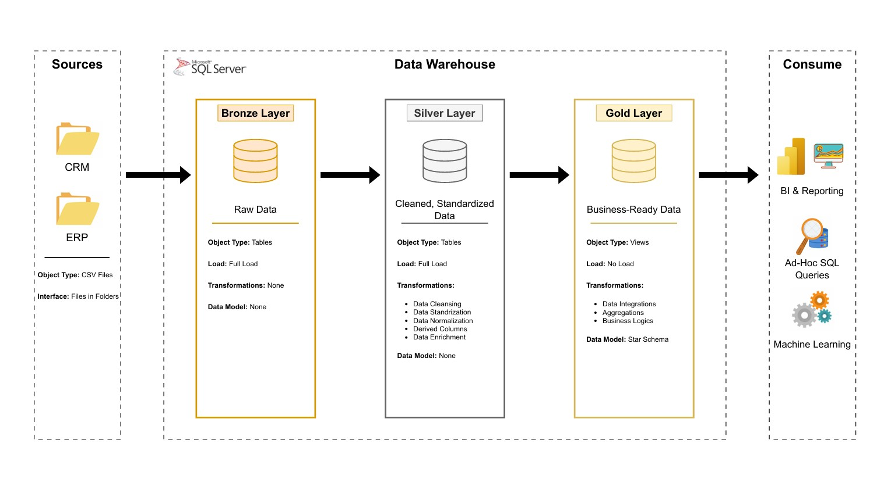
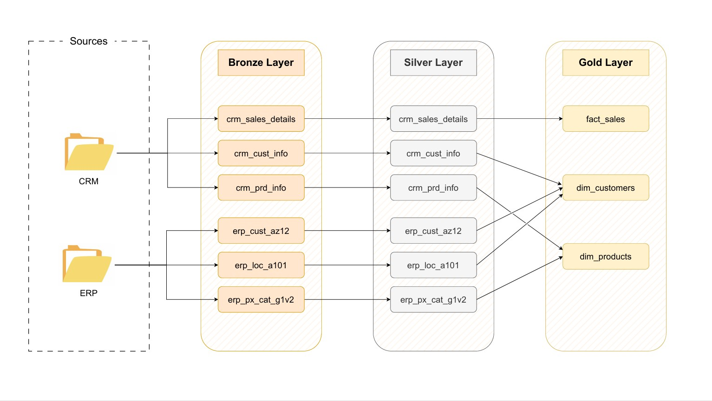
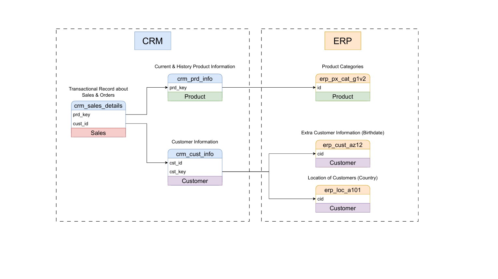
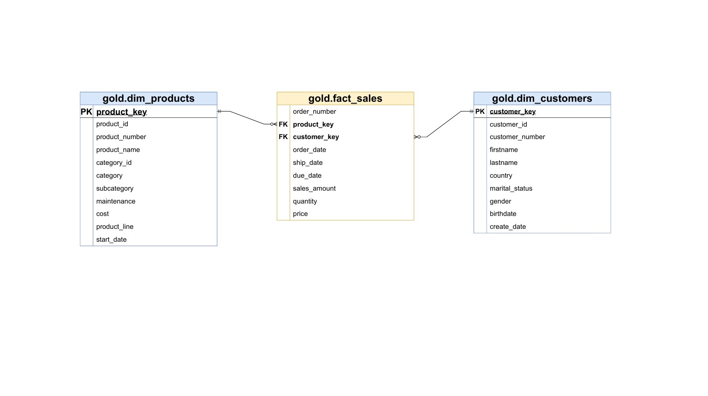

# 🏗️ SQL Medallion Data Warehouse Project


## 📖 Overview
This repository implements a **Medallion Architecture** on SQL Server, guiding raw data from ingestion through cleansing to analytics-ready marts.  
It comprises three layers:
- **🥉 Bronze**: Raw, unaltered source tables  
- **🥈 Silver**: Cleansed, conformed, and enriched datasets  
- **🥇 Gold**: Curated fact tables and dimensions optimized for BI  

Built-in data quality checks and clear separation of layers ensure maintainability, scalability, and high data integrity.

---

## 📐 Project Architecture
  
*Three-stage pipeline—Bronze ingestion, Silver transformations, Gold consumption.*

---

## 🔄 Data Flow
  
*End-to-end ETL from source CSVs through SQL procedures to downstream marts.*

---

## 🔗 Data Integration
  
*Integration of multiple source systems (CRM & ERP) into a unified Bronze zone.*

---

## 🗺️ Data Model
  
*Star-schema design for Gold layer, enabling performant analytics.*

---

## 📑 Table of Contents
1. [Overview](#%F0%9F%93%96-overview)  
2. [Project Structure](#%F0%9F%93%92-project-structure)  
3. [Data Sources](#%F0%9F%97%83-data-sources)  
4. [Bronze Layer](#🥉-bronze-layer)  
   - [DDL Scripts](#bronze-layer-ddl-scripts)  
   - [Ingestion Procedures](#bronze-layer-ingestion-procedures)  
5. [Silver Layer](#🥈-silver-layer)  
   - [DDL Scripts](#silver-layer-ddl-scripts)  
   - [Transformation Procedures](#silver-layer-transformation-procedures)  
6. [Gold Layer](#🥇-gold-layer)  
   - [DDL Scripts](#gold-layer-ddl-scripts)  
7. [Data Quality & Testing](#✅-data-quality--testing)  
8. [Deployment & Usage](#🚀-deployment--usage)  
9. [Future Enhancements](#🔮-future-enhancements)  
10. [References](#📚-references)  
11. [License](#🛡️-license)  

---

## 📂 Project Structure
```
sql_medallion_data_warehouse_project/
│
├── datasets/
│   ├── source_crm/                   # raw CSV files from CRM system
│         ├── cust_info.csv
│         ├── prd_info.csv
│         └── sales_details.csv
│   └── source_erp/                    # raw CSV files from ERP system 
│         ├── cust_az12.csv
│         ├── loc_a101.csv
│         └── px_cat_g1v2.csv
│
├── doc/
│   ├── data_catalog.md                   # Data catalog for gold layer
│   ├── data_flow.jpg                        # Data flow diagram
│   ├── data_integration.jpg             # Data integration diagram
│   ├── data_model.jpg                     # Data model diagram for gold layer
│   └── project_architecture.jpg      # Project architecture design
│
├── scripts/
│   └── bronze/                                       # Bronze layer scripts
│         ├── ddl_bronze.sql                         # DDL Bronze layer scripts
│         └── proc_load_bronze.sql            # Procedure Bronze layer scripts
│   └── gold/                                           # Gold layer scripts
│         └── ddl_gold.sql                             # Create Gold views scripts
│   └── silver/                                         # Silver layer scripts
│         ├── ddl_silver.sql                           # DDL Silver layer scripts
│         └── proc_load_silver.sql              # Procedure Silver layer scripts
│   └── init_database.sql                     # Create database script
│
├── tests/
│   ├── quality_check_gold.sql                  # SQL tests for Gold layer
│   └── quality_check_silver.sql                # SQL tests for Silver layer
│
├── .gitignore
├── README.md
└── LICENSE
```

---

## 🗃️ Data Sources
- **CRM Extracts** (`datasets/source_crm/`):
  - `cust_info.csv`  
  - `prd_info.csv`  
  - `sales_details.csv`  
- **ERP Extracts** (`datasets/source_erp/`):
  - `cust_az12.csv`  
  - `loc_a101.csv`  
  - `px_cat_g1v2.csv`  

---

## 🥉 Bronze Layer

### Bronze Layer DDL Scripts
- `scripts/bronze/ddl_bronze.sql`  
  - Defines raw staging tables:  
    - `bronze.crm_cust_info`  
    - `bronze.crm_prd_info`  
    - `bronze.crm_sales_details`  
    - `bronze.erp_*`

### Bronze Layer Ingestion Procedures
- `scripts/bronze/proc_load_bronze.sql`  
  - Bulk-loads CSV data into the Bronze schema  

---

## 🥈 Silver Layer

### Silver Layer DDL Scripts
- `scripts/silver/ddl_silver.sql`  
  - Creates cleansed tables with uniform types and conformed entities  

### Silver Layer Transformation Procedures
- `scripts/silver/proc_load_silver.sql`  
  - Applies data cleaning, deduplication, and joins across Bronze tables  

---

## 🥇 Gold Layer

### Gold Layer DDL Scripts
- `scripts/gold/ddl_gold.sql`  
  - Builds star-schema views and final fact/dimension tables for BI  

---

## ✅ Data Quality & Testing
- `tests/quality_check_silver.sql`  
- `tests/quality_check_gold.sql`  
- Includes null checks, referential integrity tests, row-count validations, and business rule assertions.

---

## 🚀 Deployment & Usage
1. **Initialize** database & schemas:  
   ```bash
   psql -f scripts/init_database.sql
2. **Load Bronze** data:
   ```bash
   psql -f scripts/bronze/ddl_bronze.sql
   psql -f scripts/bronze/proc_load_bronze.sql
3. **Transform to Silver**:
   ```bash
   psql -f scripts/silver/ddl_silver.sql
   psql -f scripts/silver/proc_load_silver.sql
4. **Build Gold** marts/views:
   ```bash
   psql -f scripts/gold/ddl_gold.sql
5. **Run Tests**:
   ```bash
   psql -f tests/quality_check_silver.sql
   psql -f tests/quality_check_gold.sql
6. **Connect** your BI tool (Power BI, Tableau, etc.) to the Gold schema for analytics.

---

## 🔮 Future Enhancements
- Automate ETL with CI/CD pipelines (GitHub Actions, Azure DevOps)
- Introduce incremental / Change Data Capture (CDC) processing
- Incorporate real-time streaming sources (Kafka, Event Hubs)
- Expand Data Quality framework with automated alerts

---

## 📚 References
- Medallion Architecture Patterns by Databricks
- Microsoft Docs: Design a Data Warehouse
- Industry best practices for ETL, data modeling, and testing

---

## 🛡️ License
This project is released under the MIT License. See LICENSE for details.
MIT License

Copyright (c) 2025 Tharadol Saekhow

Permission is hereby granted, free of charge, to any person obtaining a copy
of this software and associated documentation files (the "Software"), to deal
in the Software without restriction, including without limitation the rights
to use, copy, modify, merge, publish, distribute, sublicense, and/or sell
copies of the Software, and to permit persons to whom the Software is
furnished to do so, subject to the following conditions:

The above copyright notice and this permission notice shall be included in all
copies or substantial portions of the Software.

THE SOFTWARE IS PROVIDED "AS IS", WITHOUT WARRANTY OF ANY KIND, EXPRESS OR
IMPLIED, INCLUDING BUT NOT LIMITED TO THE WARRANTIES OF MERCHANTABILITY,
FITNESS FOR A PARTICULAR PURPOSE AND NONINFRINGEMENT. IN NO EVENT SHALL THE
AUTHORS OR COPYRIGHT HOLDERS BE LIABLE FOR ANY CLAIM, DAMAGES OR OTHER
LIABILITY, WHETHER IN AN ACTION OF CONTRACT, TORT OR OTHERWISE, ARISING FROM,
OUT OF OR IN CONNECTION WITH THE SOFTWARE OR THE USE OR OTHER DEALINGS IN THE
SOFTWARE.
